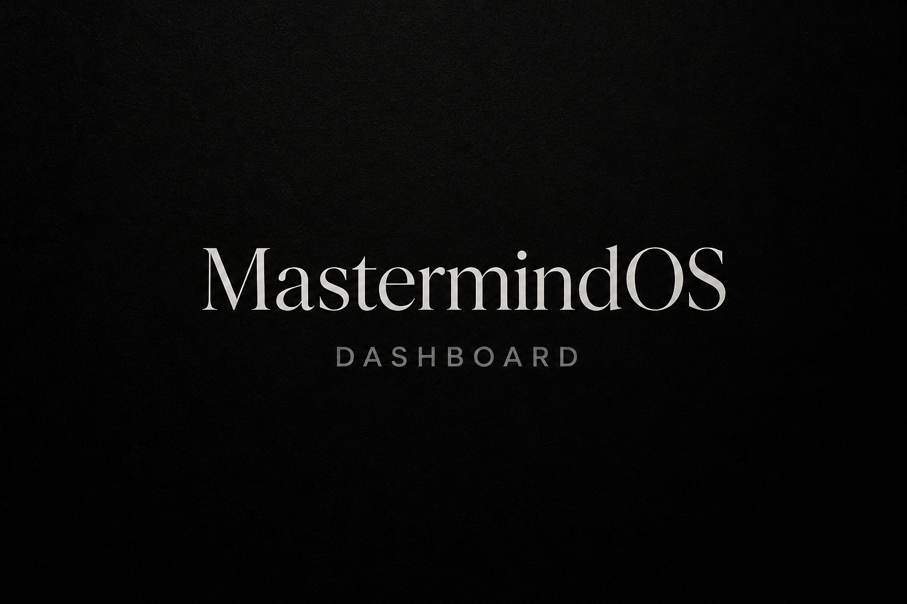

<p align="center">
  
</p>

# MastermindOS

Dark orbital console for the live project dashboards — not the 2021 Mastermind game, not that org.

The home view is labeled **SYSTEM ONLINE / MASTERMIND OS**. The core sits in the center. Seven nodes orbit it. Each node opens a project with its own Module Control sidebar.

## Nodes on the orbit

Copied from the selector in `client/src/pages/ProjectsOverview.tsx`. Nothing else is on the ring.

| Node | Card type | What that card says | Route |
| --- | --- | --- | --- |
| Viral TB | Social Growth | Viral content tracking and analytics dashboard | `/dashboard/viral-bot` |
| Iceball | Analytics | Image processing and Gemini API analytics dashboard | `/dashboard/iceball-bot` |
| Iceball Trend Generator | Image Generation | Winter portrait generation with NanoBanana API | `/dashboard/iceball-trend-generator` |
| VIP Passport | Engagement | VIP missions, rewards, and user engagement platform | `/dashboard/vip-passport` |
| Affiliate Bot | Instagram Automation | Real-time Instagram DM bot for affiliate marketing and customer engagement | `/dashboard/affiliate-bot` |
| Instagram DM Bot | Bulk Messaging | Bulk Instagram DM campaigns with Google Sheets integration | `/dashboard/instagram-dm` |
| ShelfTalker | Aging Simulation | 20-year aging simulation and story image generation for skincare marketing | `/dashboard/collamin-shelftalker` |

## Module Control

Per-project sidebars, from `client/src/components/dashboard/Sidebar.tsx`:

- **Viral TB** — Overview, Content Tracking, Analytics, Network Map, Bot Settings
- **Iceball** — Overview, Analytics, Image Processing, Data Models, System Config
- **VIP Passport** — Overview, Missions, Rewards, User Engagement, Platform Settings
- **Instagram DM** — Overview, Campaigns, Accounts, Logs, Settings
- **Affiliate Bot** — Overview, Conversations, Logs, Settings
- **Iceball Trend Generator** — Dashboard

A shared `/bot/:id` shell also exists (inbox, analytics, knowledge, settings) for bots that use the generic session pages.

## What this repo is

One Express process serves the React client (Vite, Wouter, TanStack Query, dark glass UI). The same process exposes `/api` for health, stats, sessions, conversations, messages, logs, and SSE (`/api/live-messages`, `/api/live-logs`). When `DATABASE_URL` is set, Drizzle talks to PostgreSQL (`shared/schema.ts`: users, sessions, conversations, messages, logs, analytics events).

Some dashboards also call or proxy sibling product services when those URLs are set. If a sibling is down, the server falls back to local storage or empty stats — it does not invent a live fleet.

## Run

```bash
npm install
npm run dev
```

`npm run dev` starts the Express + Vite process with `PORT=5173`. Override `PORT` if that port is taken.

```bash
npm run build    # client → dist/public, server → dist/index.cjs
npm run start    # production bundle
npm run check    # tsc
npm run db:push  # Drizzle schema → Postgres (needs DATABASE_URL)
```

## Environment

Only variables this repo actually reads:

| Variable | Where | Role |
| --- | --- | --- |
| `PORT` | server | Listen port (`5000` if unset; `dev` script sets `5173`) |
| `NODE_ENV` | server / Vite | `development` vs `production` static serve |
| `DATABASE_URL` | server / Drizzle | Optional Postgres |
| `AFFILIATE_BOT_API_URL` | server | Affiliate bot proxy (`http://localhost:3001` if unset) |
| `VIRAL_BOT_API_URL` | server | Viral bot proxy (`http://localhost:3000` if unset) |
| `ICEBALL_TREND_API_URL` | server | Trend generator proxy |
| `MASTERMIND_BOT_KEY` | server | Optional key on `POST /api/events` |
| `VITE_EXPLAINER_API` | client | Generic `/bot/:id` client |
| `VITE_VIP_API` | client | VIP Passport client |
| `VITE_AUTO_DM_API` | client | Auto DM client (pages exist; not on the orbit) |
| `VITE_VIRAL_BOT_API` | client | Viral TB client |
| `VITE_ICEBALL_API` | client | Iceball client |
| `VITE_INSTAGRAM_DM_API` | client | Instagram DM client (`http://localhost:8080/api` if unset) |
| `VITE_COLLAMIN_API` | client | ShelfTalker client (`http://localhost:3001` if unset) |

## Layout

```
client/    orbital home + project dashboards
server/    Express, routes, storage, SSE
shared/    Drizzle schema + shared API types
docs/      dark social plate
```
